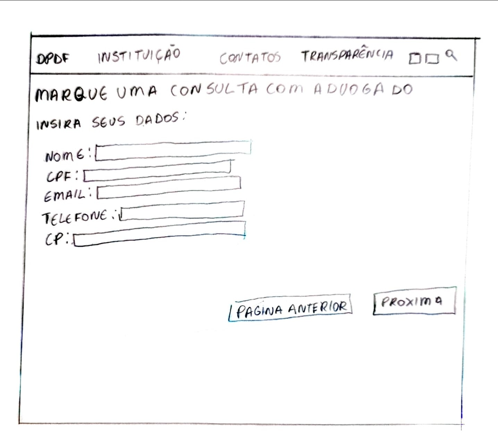
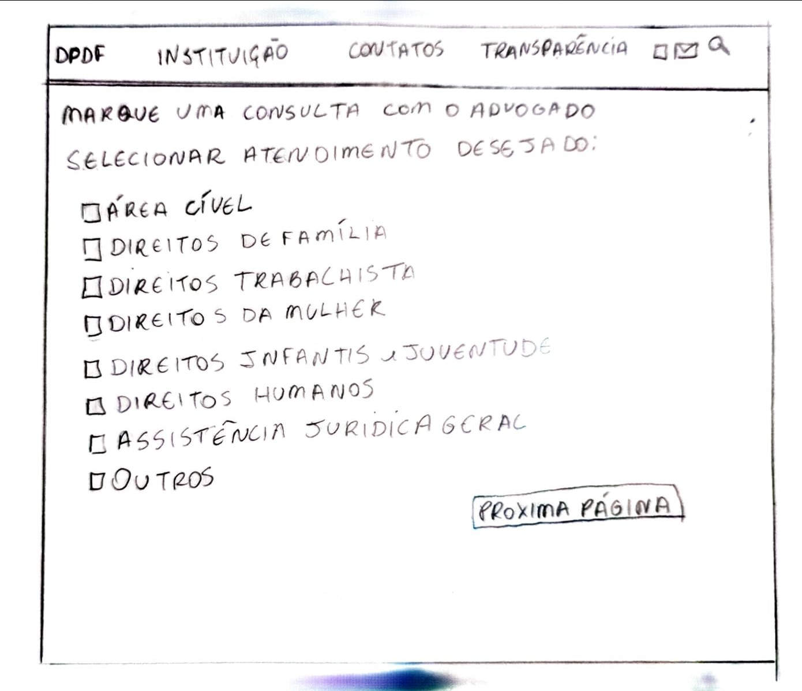
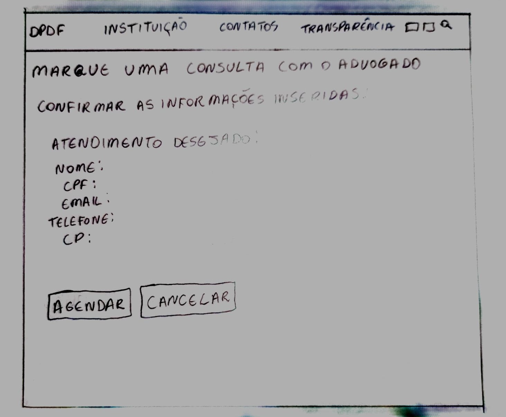
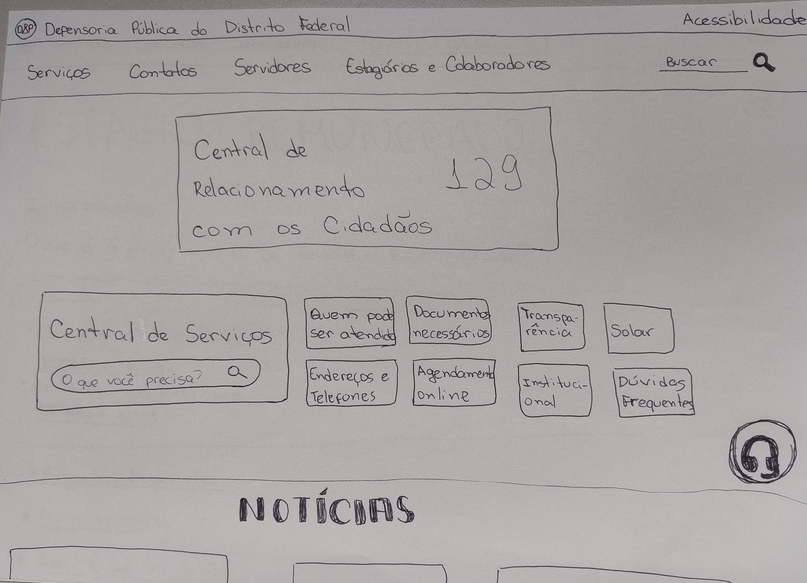
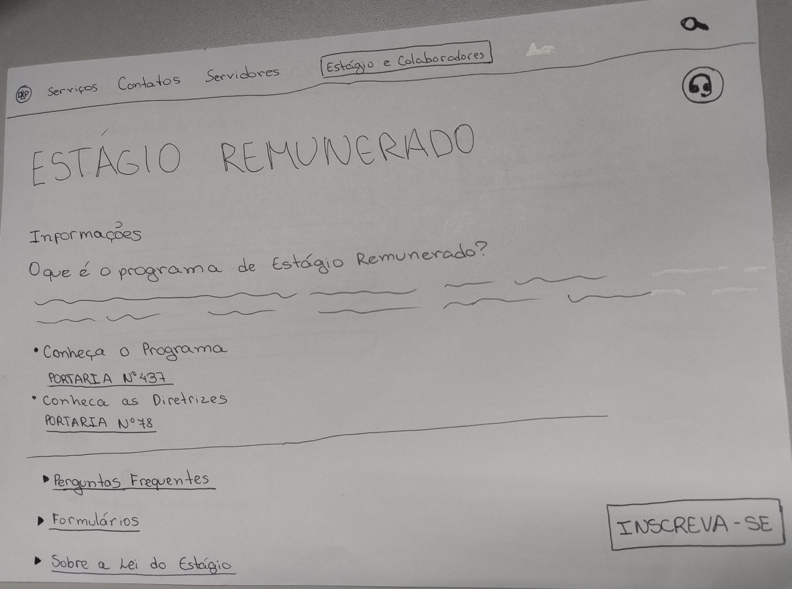
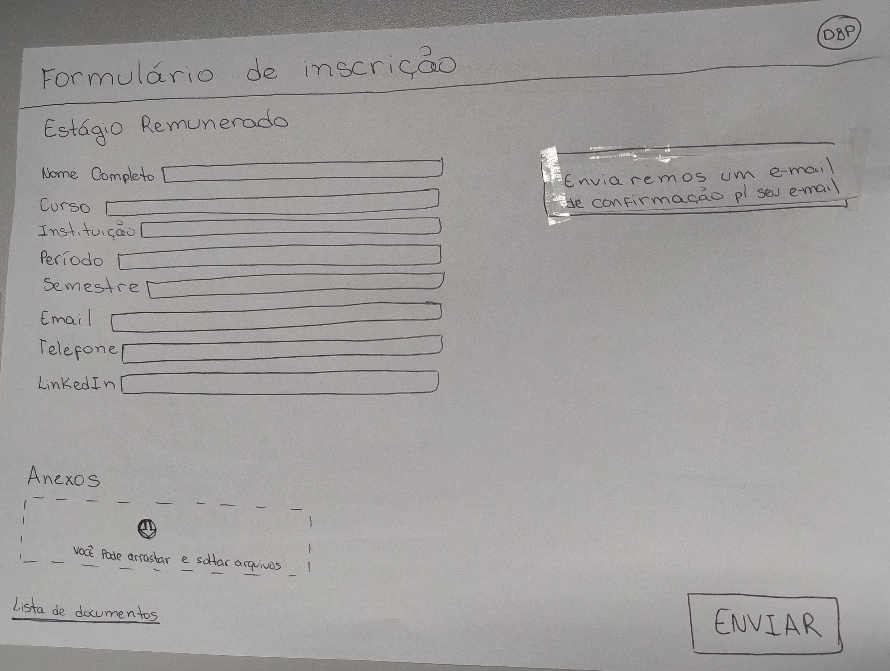
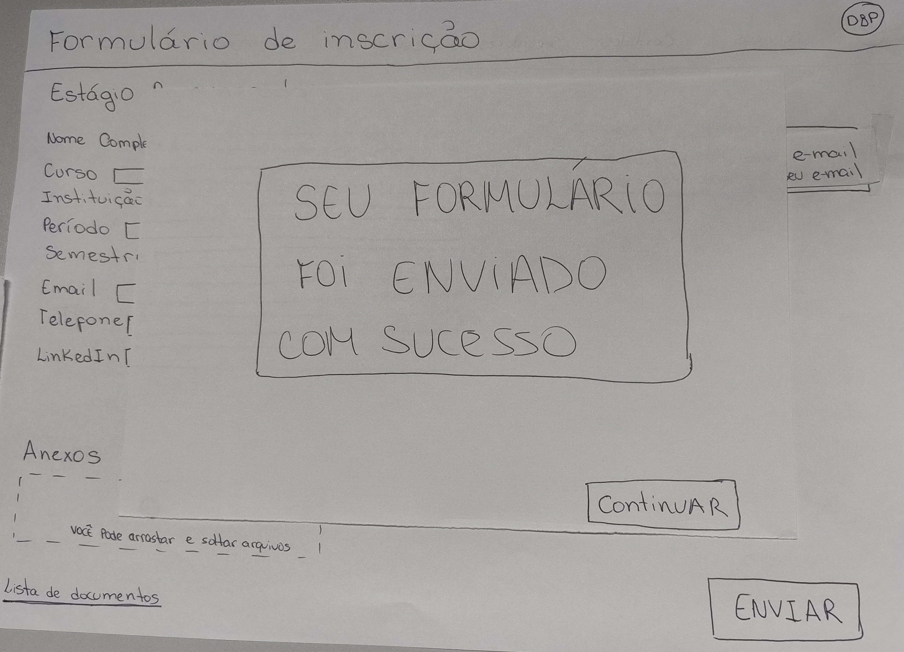

|    **Data**    | **Data Prevista de Revisão** | **Versão** |        **Descrição**        |                 **Autor**                 |                **Revisor**                 |
|:--------------:|:---------------------------:|:----------:|:---------------------------:|:-----------------------------------------:|:------------------------------------------:|
|  18/01/2024    |        03/01/2025          |    1.0     |     Criação do Documento     | [Karolina Vieira](https://github.com/Karolina91) |  [Paola Nascimento](https://github.com/paolaalim) |

# **Protótipos de Papel**

## Introdução

Um protótipo é uma representação simplificada de um design que possibilita a interação dos usuários com ele, permitindo a avaliação de sua funcionalidade e adequação. Prototipar é essencial para responder perguntas e auxiliar os designers na escolha entre diferentes opções. Entre seus principais objetivos estão:

- Testar a viabilidade técnica de uma ideia.
- Esclarecer requisitos pouco definidos.
- Realizar testes e avaliações com usuários.
- Garantir a compatibilidade do design com o restante do sistema.

Protótipos de baixa fidelidade são representações que se distanciam do produto final em termos de aparência e materiais, utilizando elementos como papel e cartolina, em vez de componentes digitais. Sua simplicidade, baixo custo e rapidez na produção tornam esses protótipos ideais para explorar alternativas e experimentar novos conceitos de design.

Uma técnica bastante popular nesse contexto é o protótipo de papel, que consiste em criar representações desenhadas da interface de um sistema em folhas de papel. Esta abordagem é de baixo custo, simples de executar e eficaz para testes rápidos de usabilidade.

## Objetivo

Seguindo o nível 02 de design, avaliação e desenvolvimento proposto por Mayhew na Engenharia de Usabilidade, o objetivo deste documento é apresentar protótipos de baixa fidelidade desenvolvidos com a técnica de protótipo de papel. Cada membro da equipe selecionou e prototipou uma tarefa específica do site da Prefeitura Municipal de Nova Iorque.

## Metodologia

Baseando-se nos storyboards e diagramas das análises de tarefas, cada integrante foi responsável por desenvolver o protótipo em papel relacionado à tarefa selecionada do site. A técnica de prototipação em papel permitiu criar representações visuais e funcionais das interações planejadas, garantindo agilidade no desenvolvimento e avaliação do design.

## Protótipo

### Agendar uma consulta com o advogado 

### Figura 1 - Tela Inicial

<figcaption>Autor: Karolina Vieira (2025)</figcaption>

### Figura 2 - Inserir Dados

<figcaption>Autor: Karolina Vieira (2025)</figcaption>

### Figura 3 - Selecionar Tipo de Atendimento

<figcaption>Autor:
 Karolina Vieira (2025)</figcaption>

### Figura 4 - Concluir Agendamento

<figcaption>Autor:
 Karolina Vieira (2025)</figcaption>

### Inscrever-se no programa de estágio 

### Figura 5 - Tela Inicial

<figcaption>Autor:
 Paola Nascimento (2025)</figcaption>

### Figura 6 - Tela de Inscrição para o Estágio

<figcaption>Autor:
 Paola Nascimento (2025)</figcaption>

### Figura 7 - Formulário de Inscrição

<figcaption>Autor:
 Paola Nascimento (2025)</figcaption>

### Figura 8 - Confirmação de Envio do Formulário

<figcaption>Autor:
 Paola Nascimento (2025)</figcaption>

## Referências Bibliográficas
BARBOSA, Simone; DINIZ, Bruno. *Interação Humano-Computador*. Editora Elsevier, Rio de Janeiro, 2010.
