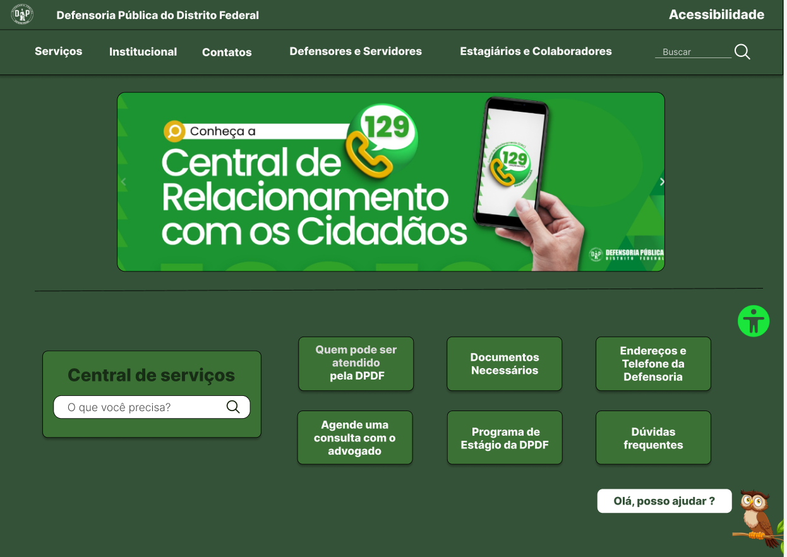
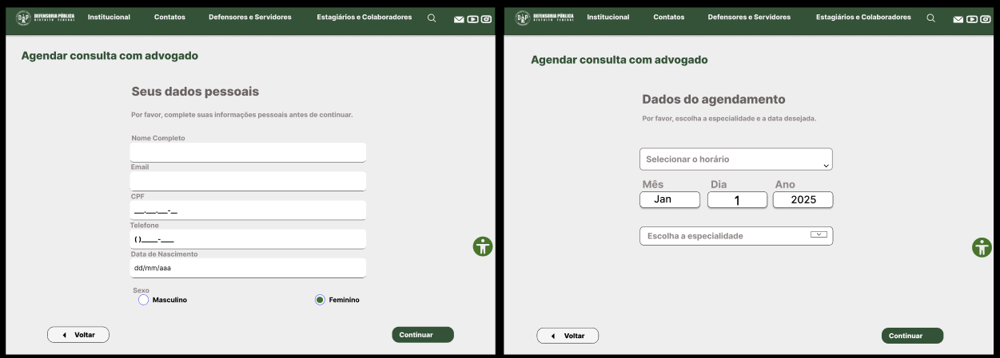
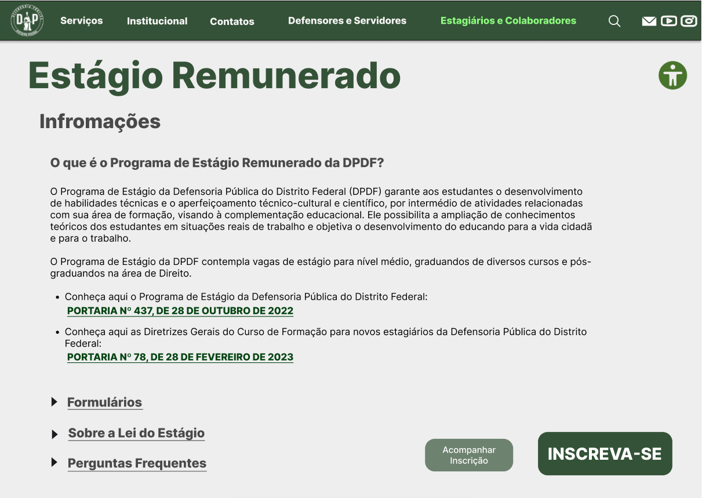
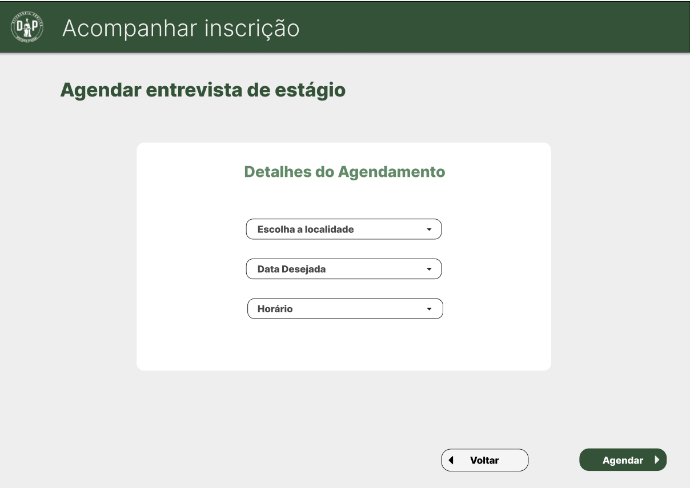

|    **Data**    | **Data Prevista de Revisão** | **Versão** |        **Descrição**        |                 **Autor**                 |                **Revisor**                 |
|:--------------:|:---------------------------:|:----------:|:---------------------------:|:-----------------------------------------:|:------------------------------------------:|
|  18/01/2025   |       18/01/2025 |  1.0     |     Criação do Documento     | [Karolina Vieira](https://github.com/Karolina91) |  [Paola Nascimento](https://github.com/paolaalim) |

# Protótipos de Alta Fidelidade

## Introdução
O protótipo de alta fidelidade é uma representação avançada do sistema proposto, que simula com precisão tanto a aparência quanto a funcionalidade do produto final. Ao contrário dos protótipos de baixa fidelidade, que se concentram em conceitos iniciais e validação de ideias básicas, o protótipo de alta fidelidade permite avaliar aspectos mais complexos, como navegabilidade, desempenho e interação do usuário com a interface. Essa abordagem busca proporcionar uma experiência mais realista ao usuário, contribuindo para a identificação de melhorias potenciais e garantindo maior alinhamento com os objetivos do projeto. Embora envolva um maior investimento de tempo e recursos, o uso de protótipos de alta fidelidade é essencial para validar decisões de design e aperfeiçoar o sistema antes de sua implementação final.

## Objetivo
Com base no nível 3 do processo de Design, Avaliação e Desenvolvimento da Engenharia de Usabilidade de Mayhew, este documento visa apresentar os protótipos de alta fidelidade desenvolvidos para as tarefas selecionadas no site da **Defensoria Pública do Distrito Federal**. A construção dos protótipos foi focada na simulação detalhada das interfaces e interações propostas, permitindo a avaliação da usabilidade, navegabilidade e aderência às necessidades dos usuários.

## Metodologia
O desenvolvimento do protótipo de alta fidelidade seguiu um processo iterativo, que teve início com a criação de protótipos de baixa fidelidade em papel. Estes serviram para definir a estrutura das interfaces e guiar o refinamento das interações.

Além disso, o **Guia de Estilo**, previamente elaborado, foi seguido durante o desenvolvimento dos protótipos de alta fidelidade, garantindo que as interfaces mantivessem consistência visual, acessibilidade e alinhamento com as necessidades do público-alvo.

## Protótipos de Alta Fidelidade
Os protótipos de alta fidelidade representam as principais funcionalidades do sistema, sendo cada uma delas desenvolvida por um integrante da equipe. A tela inicial, comum a todas as funcionalidades, foi projetada para oferecer uma navegação clara e acessível, servindo como ponto de entrada para opções como agendamento de consultas com advogado e increve-se em um programa de estágio. 

### Figura 1 -Proposta da Tela Incial da Defensoria Publica Distrito Federal 

<figcaption>Autor: Karolina Vieira (2025)</figcaption>

A seguir, são detalhados os protótipos de alta fidelidade desenvolvidos para cada funcionalidade:

## Protótipo de Alta Fidelidade 1 - Agendar uma consulta com advogado

Esta funcionalidade foi projetada para facilitar o acesso dos cidadãos ao agendamento de consultas online com advogados no site da DPDF, promovendo praticidade e eficiência na interação com o serviço público.

### Figura 2-Tela Principal do agendamento com advogado

<figcaption>Autor: Karolina Vieira (2025)</figcaption>

### Figura 3 -Definir agendamento
<figcaption>Autor: Karolina Vieira (2025)</figcaption>

## Protótipo de Alta Fidelidade 2 - Increve-se no Programa de Estágio DPDF

### Figura 4 -Tela de Estágio Remunerado
<figcaption>Autor: Paola Nascimento (2025)</figcaption>

### Figura 5 -Formulário de inscrição
<figcaption>Autor: Paola Nascimento (2025)</figcaption>

### Figura 6 -Tela de login para a sessão Acompanhar inscrição
<figcaption>Autor: Paola Nascimento (2025)</figcaption>

### Figura 7 -Tela de acompanhar inscrição
<figcaption>Autor: Paola Nascimento (2025)</figcaption>

### Figura 8 -Tela para agendar entrevista
<figcaption>Autor: Paola Nascimento (2025)</figcaption>

### Figura 9 -Tela para excluir inscrição
<figcaption>Autor: Paola Nascimento (2025)</figcaption>

### Figura 10 -Mensagens de erro e êxito
<figcaption>Autor: Paola Nascimento (2025)</figcaption>

## Referências Bibliográficas
BARBOSA, Simone; DINIZ, Bruno. *Interação Humano-Computador*. Editora Elsevier, Rio de Janeiro, 2010.
