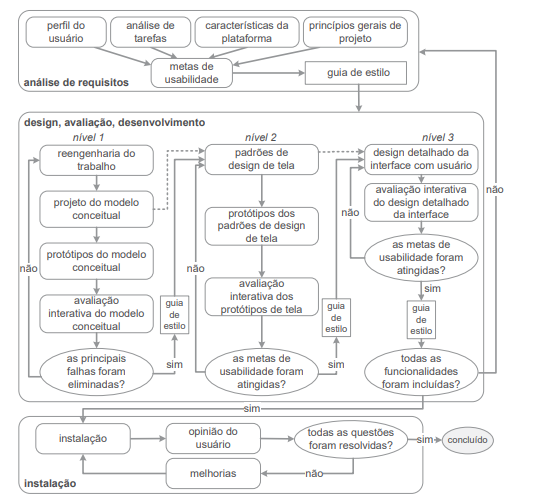

## Histórico de Versão

|    **Data**    | **Data Prevista de Revisão** | **Versão** |        **Descrição**        |                 **Autor**                 |                **Revisor**                 |
|:--------------:|:---------------------------:|:----------:|:---------------------------:|:-----------------------------------------:|:------------------------------------------:|
|  10/02/2024    |        10/02/2024          |    1.0     |     Criação do Documento     | [Karolina Vieira](https://github.com/Karolina91) |  [Paola Nascimento](https://github.com/paolaalim) |

# **Ciclo de Vida**

# Introdução

A Engenharia de Usabilidade de Mayhew fornece um modelo estruturado para a condução de atividades na área de Interação Humano-Computador. Esse ciclo de vida orienta o processo de design de forma iterativa, permitindo a compreensão detalhada do perfil dos usuários antes da fase de concepção da interface. Além disso, cada etapa do ciclo de vida é sustentada por avaliações constantes, garantindo que as decisões sejam validadas e refinadas ao longo do desenvolvimento.

## Motivo da Escolha

A escolha desse ciclo de vida foi resultado de uma discussão entre os integrantes do grupo, que analisaram diferentes abordagens e suas respectivas vantagens e desvantagens. O modelo de Mayhew se destacou por sua estrutura detalhada e bem definida, reduzindo a subjetividade no processo de desenvolvimento da interface. Além disso, sua robustez facilita a identificação de problemas de usabilidade e a implementação de melhorias iterativas. A recomendação do professor para o uso desse ciclo também influenciou a decisão, considerando a necessidade de um modelo sólido para guiar o projeto, especialmente para um grupo sem experiência prévia na área de IHC.

## Aplicação à Defensoria Pública

A implementação do ciclo de vida de Mayhew no contexto da Defensoria Pública do Distrito Federal permitirá um estudo mais aprofundado das necessidades dos usuários que acessam o site em busca de assistência jurídica. A abordagem iterativa do modelo possibilita ajustes contínuos, garantindo que as melhorias propostas estejam alinhadas com as reais demandas do público atendido pela instituição. Além disso, o detalhamento das etapas do ciclo de vida facilitará a documentação e a justificativa das decisões tomadas ao longo do projeto.

## **Ciclo de vida Mayhew**

 Figura 1 - Fluxo do Ciclo de Vida Mayhew
 

## Conclusão

A aplicação do ciclo de vida de Mayhew à análise do site da Defensoria Pública do Distrito Federal oferece uma estrutura clara e eficiente para conduzir melhorias na usabilidade da plataforma. A metodologia adotada garantirá que o desenvolvimento das propostas seja baseado em critérios sólidos, proporcionando uma experiência mais intuitiva e acessível para os usuários do serviço.

## Bibliografia

[1] BARBOSA, S. et al. Interação Humano-Computador e Experiência do Usuário. [s.l.] Autopublicação - Leanpub, 2021.